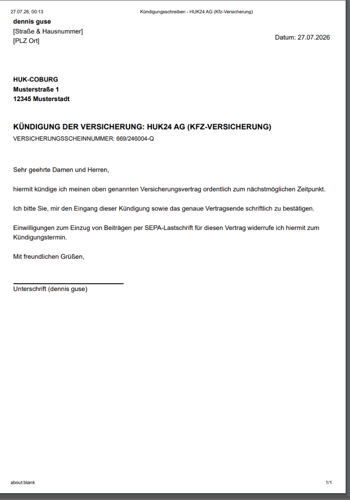

# 🛡️ Noxus Policy — KI-gestützte Dokumentenanalyse & Versicherungsmanager

<p align="center">
  
</p>

<p align="center">
  <b>Moderne, selbsgehostete Open-Source Plattform zur automatischen Analyse, Verwaltung und Fristen-Überwachung von Versicherungspolicen.</b><br>
  <i>100% Datenschutzkonform • Lokale KI (Qwen2.5-1.5B) • Proxmox LXC 1-Klick Installation</i>
</p>

<p align="center">
  <a href="#-proxmox-ve--linux-1-klick-installation"></a>
  <a href="#-tech-stack"></a>
  <a href="#-tech-stack"></a>
  <a href="#-tech-stack"></a>
  <a href="#-lokale-ki-engine-qwen25-15b"></a>
</p>

---

## 🔑 Standard Admin-Zugangsdaten (Erst-Login)

Nach der Installation ist das System mit folgenden Standard-Zugangsdaten erreichbar:

| Parameter | Standard-Wert |
| :--- | :--- |
| **Benutzername / E-Mail** | `admin` *(oder `Admin`)* |
| **Passwort** | `admin` |

> 🔒 **Sicherheitshinweis:** Beim allerersten Anmelden wirst du aus Sicherheitsgründen automatisch auf die Einrichtungsseite geleitet, um dein persönliches Administrator-Passwort festzulegen.

---

## 🚀 Proxmox VE & Linux 1-Klick Installation

Noxus Policy lässt sich in Sekunden auf jedem **Proxmox VE Server** oder **Linux LXC/Debian/Ubuntu** installieren.

### 🌟 Option A: Proxmox VE Host 1-Klick Erstellung (Erstellt neuen LXC Container)
Führe diesen Befehl in der **Proxmox VE Node Shell** (Host-Ebene) aus:

```bash
bash -c "$(wget -qLO - https://raw.githubusercontent.com/KaelanTesseract/Noxus-Policy/main/proxmox-install.sh)"
```

### ⚡ Option B: Installation in einem bestehenden Linux / LXC Container
Führe diesen Befehl im **Terminal deines bestehenden Containers/Servers** aus:

```bash
bash -c "$(wget -qLO - https://raw.githubusercontent.com/KaelanTesseract/Noxus-Policy/main/install.sh)"
```

---

## 🔄 1-Klick Auto-Update (mit Live-Ladebalken & Auto-Backup)

Um das System jederzeit auf den neuesten Stand zu bringen, tippe im Container-Terminal einfach folgenden Befehl ein:

```bash
update
```

Das Skript erstellt **automatisch ein Vorab-Sicherheitsbackup** der Datenbank im Ordner `/opt/versicherungsmanager/backups/`, führt einen sauberen Code-Rebuild aus und zeigt dir den Fortschritt in einem **interaktiven Ladebalken**:

```text
[█████████████████░░░░░░░░░░░░]  55% | 3/5: Lade neueste Version herunter...
```

Das System prüft im Hintergrund automatisch, ob eine neue Version auf GitHub verfügbar ist, und zeigt dies **dezent im Fußbereich des Dashboards** an.

---

## ✨ Hauptfunktionen

### 👥 1. Benutzer- & Rollenverwaltung
* **Erster Admin-Setup (`/admin-setup`):** Sichere Ersteinrichtung mit erzwungener Passwort-Änderung für den ersten Administrator.
* **Benutzerregistrierung & Admin-Panel:** Admins können neue Benutzer anlegen, Passwörter zurücksetzen und Systemeinstellungen verwalten.
* **Automatische Session-Abmeldung (`/session-expired`):** Läuft eine Sitzung ab (401 Unauthorized), wird der Nutzer auf eine Infoseite weitergeleitet und automatisch nach 5 Sekunden zum Login zurückgeführt.

### 📅 1. iCal-Kalender-Export & E-Mail-Erinnerungen für Kündigungsfristen
* **1-Klick iCal-Export (.ics):** In der Detailansicht jeder Versicherung kann per Button ein `.ics`-Kalendertermin generiert werden, der sich direkt in **Apple Kalender, Google Calendar oder Outlook** importieren lässt.
* **Automatische E-Mail-Vorwarnungen:** Ein Hintergrund-Service benachrichtigt Nutzer automatisch 30 Tage vor Ablauf einer Kündigungsfrist per E-Mail.
* **Bedingte Benutzer-Option:** Die E-Mail-Benachrichtigungsoption erscheint in den persönlichen Einstellungen jedes Benutzers nur dann, wenn der Administrator einen SMTP-Server hinterlegt hat. Jeder Nutzer kann die Benachrichtigung selbstständig ein- oder ausschalten.

### 📊 2. Visuelles Kosten- & Sparten-Diagramm
* **Interaktives Balkendiagramm:** Visuelle Aufschlüsselung der jährlichen Gesamtausgaben nach Versicherungskategorie (z.B. *Kfz, Privathaftpflicht, Hausrat, Rechtsschutz*).
* **Individuell Ein-/Ausschaltbar:** Jeder Benutzer kann das Diagramm in seinen persönlichen Einstellungen (*Einstellungen ➔ Design & Erscheinungsbild*) beliebig aktivieren oder deaktivieren.
* **Interaktive Sparten-Filter:** Ein Klick auf ein Segment im Diagramm oder einen Sparten-Chip filtert die Verträge sofort in Echtzeit.
* **Echtzeit-Suchleiste & Sortierung:** Schnellsuche nach Vertragsnamen, Gesellschaft oder Scheinnummer sowie Sortierung nach Kündigungsfrist, Kosten oder Alphabet.

### 💾 3. Auto-Backup & Wiederherstellungs-System
* **Automatisches Vorab-Backup:** Bei jedem System-Update per `update` wird eine Sicherungskopie der Datenbank unter `/opt/versicherungsmanager/backups/insurance_backup_DATUM_UHRZEIT.db` angelegt.
* **Manuelle & Geplante Sicherung:** Über die Web-Oberfläche (`/settings` ➔ Systemeinstellungen) können Admins jederzeit 1-Klick-Datenbank-Sicherungen auslösen oder herunterladen.

### 🤖 3. Lokale KI-Engine (Qwen2.5-1.5B via Llama-cpp)
* **100% Lokal & Privat:** Kein Versenden vertraulicher Versicherungsdokumente an externe Cloud-APIs.
* **Intelligente Datensatz-Erkennung:** Extraktion von *Gesellschaft, Polizzen-Nummer, Kündigungsfrist, Ablaufdatum, Beiträgen & Zahlungsintervallen*.
* **Semantische Leistungs-Analyse:** Auswertung komplexer Deckungsbausteine als saubere Nomen-Stichpunkte in Klammern.

### ⚡ 4. Dual-Engine & Neutrales Branding
* **Admin-Toggle in den Einstellungen:** Switsche beliebig zwischen KI-Analyse und klassischer OCR.
* **Dynamisches Branding:** Bei deaktivierter KI werden sämtliche `[AI]`-Badges und KI-Erwähnungen in der gesamten Oberfläche neutralisiert.

### 🏢 5. Automatisches Firmen-Logo & DACH-Abdeckung (70+ Versicherer)
* **Automatische Firmen-Logos:** Erkennt Gesellschaften (HUK24, Allianz, AXA, Generali, ERGO, DEVK, Barmenia u.v.m.) und lädt die Marken-Logos transparent ohne manuelles Hochladen.
* **Sämtliche Versicherungssparten:** Kfz, Privathaftpflicht, Hausrat, Wohngebäude, Berufsunfähigkeit (BU), Rechtsschutz, Zahnzusatz, Krankenkasse, Tierhalter- & Reiseversicherungen.

### 🎨 6. 6 Wunderschöne Design-Themen & Akzentfarben
Jeder Benutzer kann unter **Einstellungen ➔ Design & Erscheinungsbild** sein persönliches Layout wählen:
* ☀️ **Klassisch Business (Hell):** Strahlend helle Oberfläche mit weißen Karten & klaren Kontrasten.
* 🌙 **Dark Neon Glass (Standard):** Modernes dunkles Glasmorphismus-Design mit Neoneffekten.
* 🌾 **Skandinavisch Warm (Soft):** Beruhigender Creme-Ton mit natürlicher Ästhetik.
* 🏙️ **Executive Slate (Dunkel-Blau):** Elegantes Nachtblau-Silber für ruhiges Arbeiten.
* 🍃 **Mint Frisch (Hell):** Erfrischendes helles Design mit Minz- & Teal-Nuancen.
* ⚡ **Cyberpunk Neon (Gamer):** Futuristisches tiefes Schwarz mit Violett-Bordüren.

---

## 💻 Empfohlene Hardware-Ressourcen

| Komponente | Minimum (OCR ohne KI) | Empfohlen (mit lokaler KI) |
| :--- | :--- | :--- |
| **Prozessor (CPU)** | 2 Kerne | **4 Kerne** (mit AVX2) |
| **Arbeitsspeicher (RAM)** | 2 GB RAM | **4 GB RAM** (Modell benötigt ~1,2 GB) |
| **Festplatte (Disk)** | 5 GB SSD | **16 GB SSD** |

---

## 🛠️ Tech Stack

* **Frontend:** Next.js 16 (App Router, Turbopack), React 19, TailwindCSS, Lucide Icons.
* **Backend:** Python 3.11, FastAPI, SQLAlchemy (SQLite3), PyPDF, Llama-cpp-python.
* **Deployment:** Docker, Docker Compose, Proxmox VE Helper Scripts (LXC).

---

## 📝 Lizenz & Copyright

Copyright (c) 2026 **Dennis Guse** ([KaelanTesseract](https://github.com/KaelanTesseract))

Dieses Projekt ist Open-Source-Software und steht unter der **[MIT Lizenz](LICENSE)**.

### 📚 Drittanbieter-Bibliotheken & Open-Source Attributierung
* **Frontend:** Next.js (MIT), React (MIT), TailwindCSS (MIT), Lucide Icons (ISC).
* **Backend:** FastAPI (MIT), Uvicorn (BSD), SQLAlchemy (MIT), PyPDF (BSD), Llama-cpp-python (MIT).
* **KI-Modell:** Qwen2.5 1.5B Instruct von Alibaba Cloud (Apache 2.0 License - Open Commercial Use).
